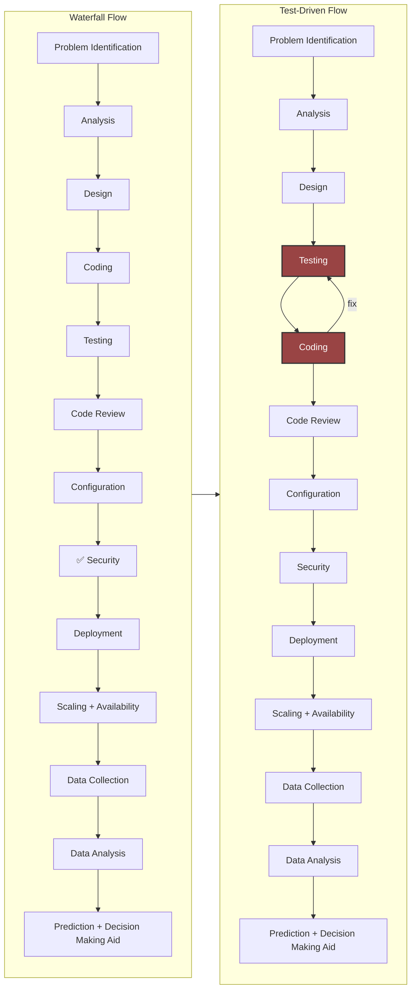
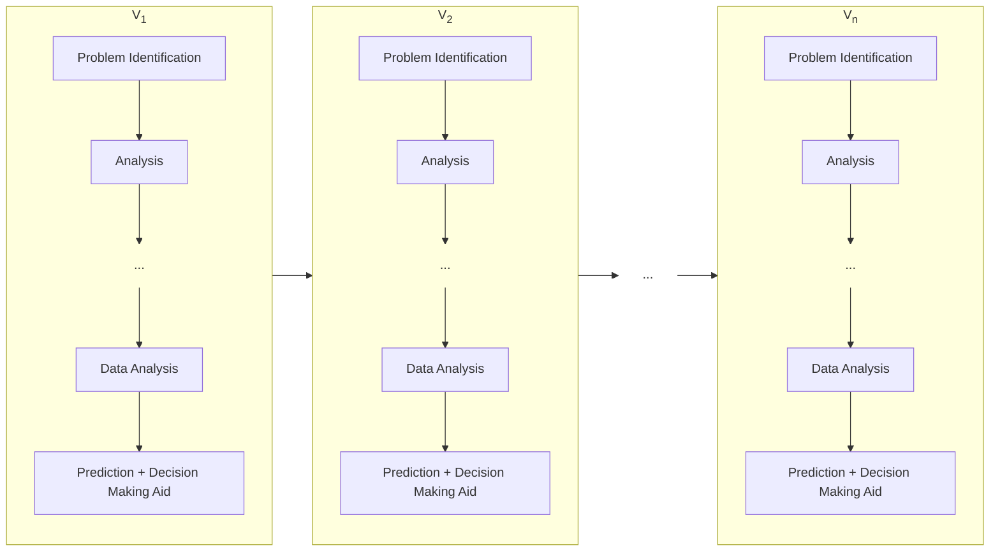
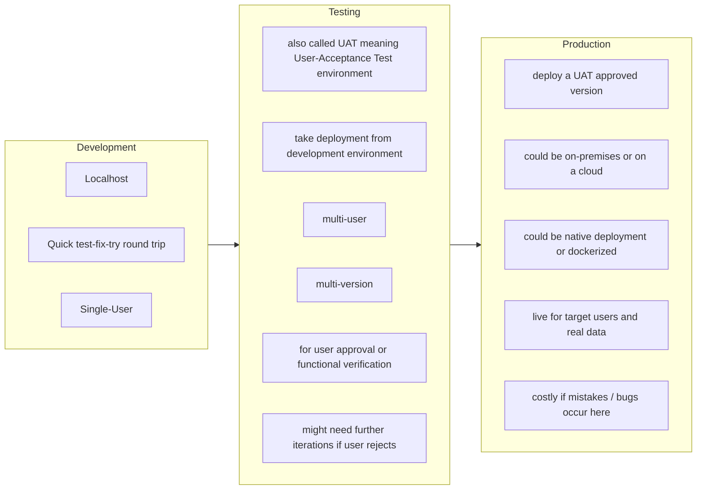
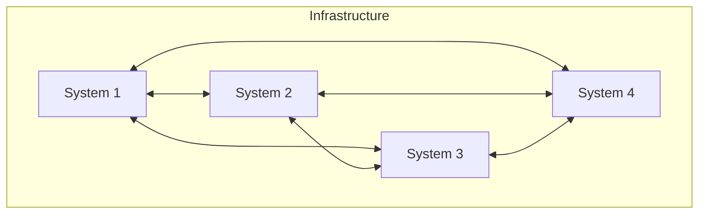

# How Real Software Development Works

## 🔄 The Software Lifecycle of a single system

**Key idea:** It’s not just coding—it’s a full process.

### ⚙️ Methodologies
#### Waterfall
- One big delivery
- Must be right first time

#### Agile + TDD
- Small steps
- Fail → fix → improve
- Sprint: 1 sprint = 1-week to 4-week cycle = sprint planning -> everyday stand up -> sprint review -> retrospective = teamwork + communication
- Scrum: define how people, event and artifacts are managed in a sprint
    - Roles
        - Product Owner defines priorities
        - Scrum Master facilitates the process
        - Development team does the work
    - Events
        - Sprint planning defines what to do in this sprint
        - Daily stand up for quick communication and blocker identification
        - Sprint review for demo and user feedback
        - Sprint retrospective for things learnt or to be improved
    - Artifacts
        - Product backlog defines what is pending to complete in later sprints (i.e. tech debt)
        - Sprint backlog are the tasks carries forward to the next sprint (subject to Product Owner approval)
        - Increment is the incremental working features built in a sprint on the product

#### Sprint Cycle (2 weeks)
Planning → Daily stand-up → Development → Demo

---

## 🧬 Software Evolution → Version Control

### 👨‍💻 Distributed Development
- Multiple developers
    - V1 and V2 can be done by 2 developers at the same time
    - developers does not need to sit together geographically
- Version control (Git)
- Code reviews
    - developers give peer reviews and comments
    - product is built upon concensus and accuracy

Software = teamwork.

---

## 🌍 Environments

### Goals
- Ensure accuracy
- Scalability
- Minimize cost of error
- Minimize cost of evolution
- Maximize system cooperation and synergy

---

## Infrastructure

**Benefit of a cooperating infrastructure &gt; Sum of benefits from individual systems**

### 🏢 Example systems in an infrastructure
- Authentication server
- Mail server
- Database
- Inventory system
- CRM system (Customer Relationship System)
- ERP system (Enterprise Resource Planning)
- Accounting system
- Internal Control system
- Human Resource system
- Helpdesk system (An example to walk you through)
    - Dashboard
    - Callbacks
    - Helpdesk
    - ...
    - Group Permissions
- Web/API server
- Firewall
- Proxy
- VPN

---

## 🔐 Security Fundamentals
- **Authentication** → Who are you? (login, Entra ID)
- **Authorization** → What can you access?
- **Permissions** → Fine-grained control (admin vs user)

Security applies at every stage.

---

## 🧠 Career Paths

### Build
- Developer
- Application Specialist

### Design
- Architect
- Cloud Engineer

### Operate
- DevOps Engineer
- Infrastructure Engineer

### Protect
- Security Engineer

### Data
- Data Engineer (pipelines)
- Data Scientist (insights)
- AI Engineer (intelligent systems)

### Business
- Business Analyst
- Product Owner

---

## 🎯 Key Takeaways
- Software = systems + people + process
- Security is everywhere
- Many career paths from the same foundations
- Real work = team problem solving
