# How Real Software Development Works

## 🔄 The Software Lifecycle of a single system
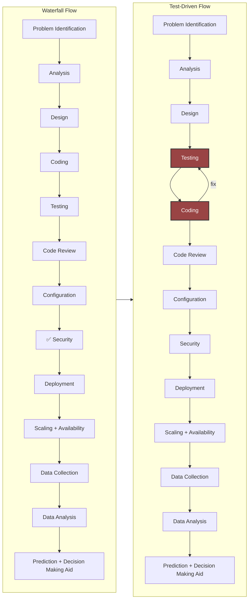
**Key idea:** It’s not just coding—it’s a full process.

### ⚙️ Methodologies
#### Waterfall
- One big delivery
- Must be right first time

#### Agile + TDD
- Small steps
- Fail → fix → improve
- Sprint: 1 sprint = 1-week to 4-week cycle = sprint planning -> everyday stand up -> sprint review -> retrospective = teamwork + communication
- Scrum: define how people, event and artifacts are managed in a sprint
    - Roles
        - Product Owner defines priorities
        - Scrum Master facilitates the process
        - Development team does the work
    - Events
        - Sprint planning defines what to do in this sprint
        - Daily stand up for quick communication and blocker identification
        - Sprint review for demo and user feedback
        - Sprint retrospective for things learnt or to be improved
    - Artifacts
        - Product backlog defines what is pending to complete in later sprints (i.e. tech debt)
        - Sprint backlog are the tasks carries forward to the next sprint (subject to Product Owner approval)
        - Increment is the incremental working features built in a sprint on the product

#### Sprint Cycle (2 weeks)
Planning → Daily stand-up → Development → Demo

---

## 🧬 Software Evolution → Version Control
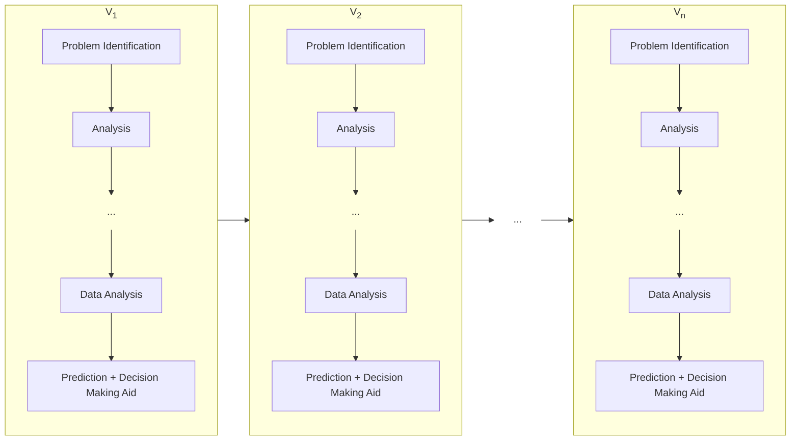

### 👨‍💻 Distributed Development
- Multiple developers
    - V1 and V2 can be done by 2 developers at the same time
    - developers does not need to sit together geographically
- Version control (Git)
- Code reviews
    - developers give peer reviews and comments
    - product is built upon concensus and accuracy

Software = teamwork.

---

## 🌍 Environments
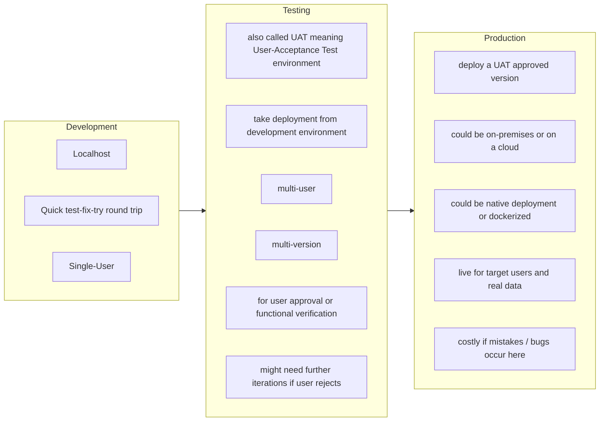

### Goals
- Ensure accuracy
- Scalability
- Minimize cost of error
- Minimize cost of evolution
- Maximize system cooperation and synergy

---

## Infrastructure

**Benefit of a cooperating infrastructure &gt; Sum of benefits from individual systems**

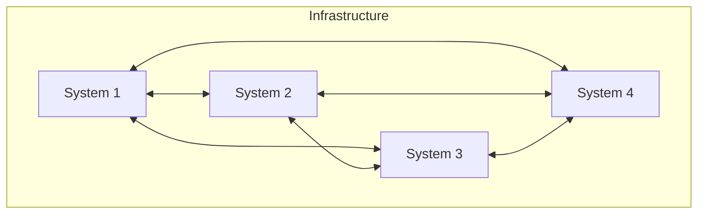

### 🏢 Example systems in an infrastructure
- Authentication server
- Mail server
- Database
- Inventory system
- CRM system (Customer Relationship System)
- ERP system (Enterprise Resource Planning)
- Accounting system
- Internal Control system
- Human Resource system
- Helpdesk system (An example to walk you through)
    - Dashboard
    - Callbacks
    - Helpdesk
    - ...
    - Group Permissions
- Web/API server
- Firewall
- Proxy
- VPN

---

## 🔐 Security Fundamentals
- **Authentication** → Who are you? (login, Entra ID)
- **Authorization** → What can you access?
- **Permissions** → Fine-grained control (admin vs user)

Security applies at every stage.

---

## 🧠 Career Paths

### Build
- Developer
- Application Specialist
- QA / Test Engineer

### Design
- Architect
- UX / UI Designer
- Cloud Engineer

### Operate
- DevOps Engineer
- Infrastructure Engineer

### Protect
- Security Engineer

### Data
- Data Engineer (pipelines)
- Data Scientist (insights)
- AI Engineer (intelligent systems)

### Business
- Business Analyst
- Product Owner

---

## 🗺️ Where Each Role Lives in the Waterfall

Each flow below highlights (**green**) the steps most central to that role. The bullets underneath explain what that role is specifically concerned with at each of those steps — the same step can mean very different things depending on who you are.

---

### 🏗️ Build

#### Developer
Designs, writes, and peer-reviews the code that delivers features.

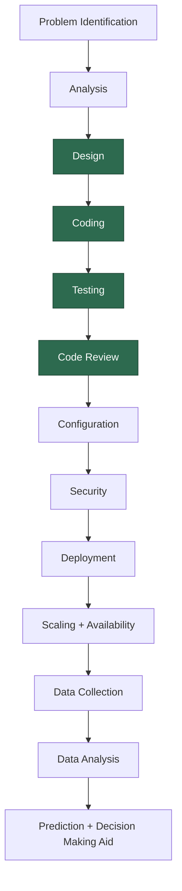

- **Design** — choosing technical approaches, data structures, and API contracts for your feature
- **Coding** — writing production code that implements the agreed design
- **Testing** — writing unit and integration tests to verify your own code works correctly
- **Code Review** — reading teammates' code to catch bugs, suggest improvements, and share knowledge

---

#### Application Specialist
Configures and customises packaged software (e.g. ERP, CRM) to match business processes.

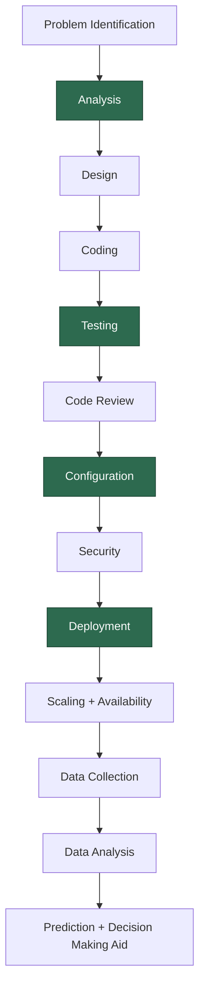

- **Analysis** — understanding how the business actually works so you know how the software must be set up
- **Testing** — validating that your configurations correctly handle each real business scenario
- **Configuration** — customising fields, workflows, permissions, and integrations inside the packaged system
- **Deployment** — rolling out updated configurations or new software versions to the right environment

---

#### QA / Test Engineer
Plans, designs, and executes tests to catch problems before they reach users.

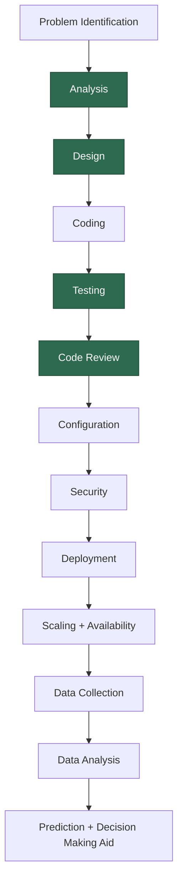

- **Analysis** — identifying what needs to be tested; writing test plans and acceptance criteria from requirements
- **Design** — designing test cases, test data sets, and automated test framework architecture
- **Testing** — executing tests, logging defects with reproducible steps, and re-testing once fixes land
- **Code Review** — reviewing code for testability; reviewing test scripts written by developers

---

### 🖊️ Design

#### Architect
Defines the overall structure of systems — how components connect, scale, and evolve.

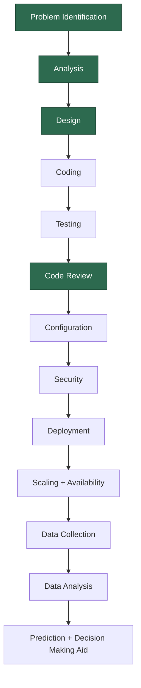

- **Problem Identification** — understanding the business problem at a *system* level; identifying which existing systems are involved or affected
- **Analysis** — defining system interactions, data flows, integration points, and non-functional requirements (performance, reliability, scalability)
- **Design** — producing the system architecture: components, APIs, databases, message queues, and infrastructure topology
- **Code Review** — ensuring built code aligns with the intended architecture and doesn't introduce structural debt

---

#### UX / UI Designer
Researches user needs and designs how the product looks, feels, and flows.

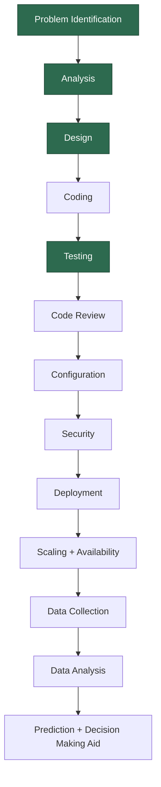

- **Problem Identification** — understanding user pain points, behaviours, and goals through observation and interviews — the *human* side of the problem
- **Analysis** — mapping user journeys, defining personas, and translating human needs into design requirements
- **Design** — wireframing, prototyping, and building visual design systems and interaction patterns
- **Testing** — usability testing with real users, A/B testing variants, and accessibility checks

---

#### Cloud Engineer
Designs and builds the cloud platforms the software runs on.

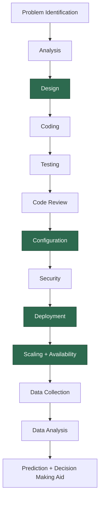

- **Design** — architecting cloud topology: regions, services, networking, and cost structure
- **Configuration** — writing infrastructure-as-code (IaC), setting up cloud services, and managing environment configs
- **Deployment** — automating deployments to cloud platforms (AWS, Azure, GCP) via pipelines and container orchestration
- **Scaling + Availability** — configuring auto-scaling policies, load balancers, CDNs, and disaster recovery

---

### ⚙️ Operate

#### DevOps Engineer
Automates the pipeline from code commit to live deployment; keeps the release process fast and reliable.

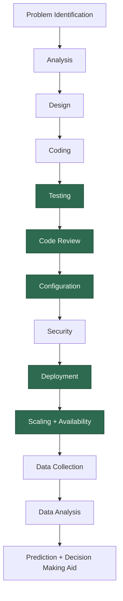

- **Testing** — building CI pipelines that automatically run the full test suite on every code change before it can merge
- **Code Review** — reviewing pipeline code, deployment scripts, and infrastructure-as-code for correctness and safety
- **Configuration** — managing build tooling, secrets management, environment configs, and release pipeline definitions
- **Deployment** — orchestrating releases; managing rollouts, rollbacks, and blue/green deployment strategies
- **Scaling + Availability** — monitoring system health, setting up alerting, and enforcing uptime targets

---

#### Infrastructure Engineer
Maintains the servers, networks, and platforms everything runs on.

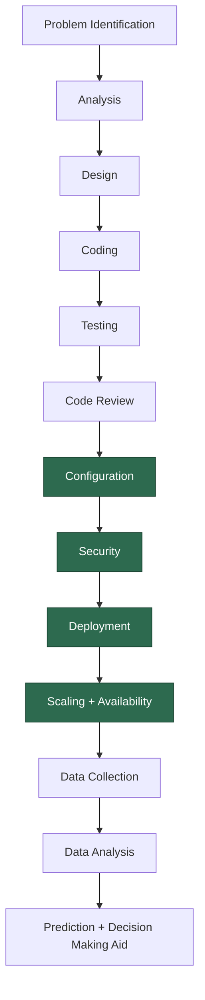

- **Configuration** — provisioning and managing servers, networks, storage, firewalls, and VPNs
- **Security** — hardening the infrastructure itself: OS patching, access controls, network segmentation, and compliance checks
- **Deployment** — managing on-premises or hybrid deployments and maintaining stable, consistent environments
- **Scaling + Availability** — capacity planning, redundancy, failover, and performance tuning at the hardware and network level

---

### 🔐 Protect

#### Security Engineer
Hunts for vulnerabilities and enforces security standards at every layer of the pipeline.

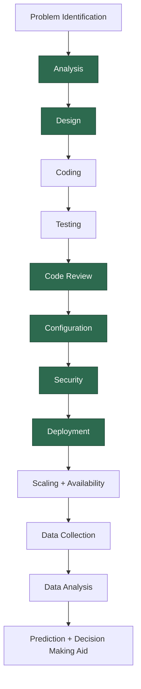

- **Analysis** — threat modelling: identifying what could be attacked, by whom, and what the business impact would be
- **Design** — defining security architecture: authentication flows, encryption standards, and access control models
- **Code Review** — reviewing code specifically for vulnerabilities such as injection, XSS, broken auth, and insecure dependencies
- **Configuration** — auditing environment configs, enforcing secrets management, and hardening system settings
- **Security** — penetration testing, vulnerability scanning, security audits, and leading incident response
- **Deployment** — verifying deployment practices are secure: no secrets in code, least-privilege access, full audit logging

---

### 📊 Data

#### Data Engineer
Builds and maintains the pipelines that collect, move, and store data reliably.

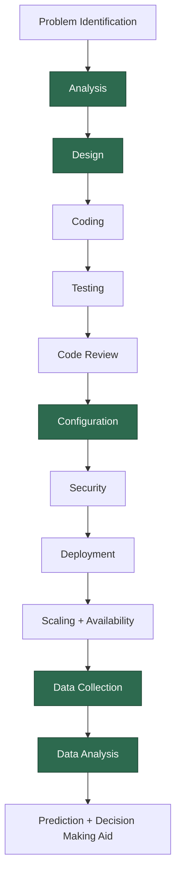

- **Analysis** — understanding what data is needed, where it lives across systems, and how it must flow to be useful
- **Design** — designing pipeline architecture, data schemas, warehouses, and ETL/ELT data transformation flows
- **Configuration** — setting up orchestration tools (Airflow, dbt), database connections, and storage infrastructure
- **Data Collection** — building and maintaining ingestion pipelines from APIs, event streams, and databases
- **Data Analysis** — building the tooling and query layers that let analysts and scientists access clean, reliable data

---

#### Data Scientist
Extracts patterns and insights from data to answer business questions.

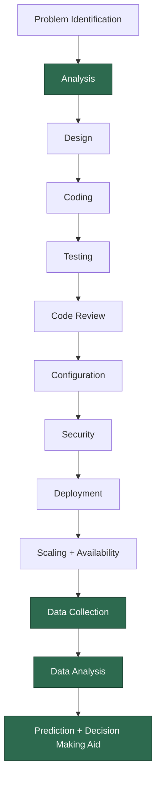

- **Analysis** — framing the business question as a solvable data problem; defining what "success" looks like in measurable terms
- **Data Collection** — exploring available datasets, assessing quality, and identifying gaps that need new data sources
- **Data Analysis** — cleaning, transforming, and statistically analysing data to surface meaningful patterns
- **Prediction + Decision Making Aid** — building statistical models, dashboards, and reports that guide real business decisions

---

#### AI Engineer
Builds and trains machine learning models that make predictions or automate decisions.

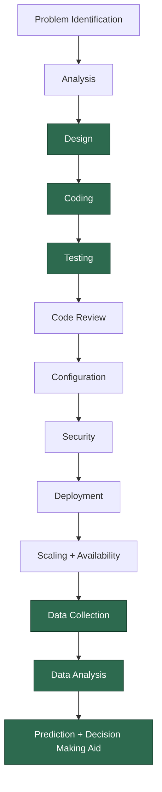

- **Design** — choosing model architecture, designing training pipelines, and planning inference infrastructure
- **Coding** — implementing ML models, fine-tuning pre-trained models, and building APIs that serve predictions
- **Testing** — evaluating model accuracy, fairness, and robustness; building benchmark datasets to measure quality
- **Data Collection** — curating, labelling, and preprocessing training data to the quality the model requires
- **Data Analysis** — feature engineering, exploratory analysis, and diagnosing why a model is performing the way it is
- **Prediction + Decision Making Aid** — deploying models to production and building systems that act on model outputs in real time

---

### 💼 Business

#### Business Analyst
Bridges the gap between what the business needs and what the tech team builds.

- **Problem Identification** — working with stakeholders to articulate the *business* problem, objectives, and measurable success criteria
- **Analysis** — gathering requirements, modelling business processes and data flows, and documenting what the system must do
- **Design** — translating requirements into functional specifications and user stories the tech team can build from
- **Testing** — supporting UAT by verifying that what was built genuinely solves the original business problem

---

#### Product Owner
Sets priorities and decides what gets built next on behalf of the business.

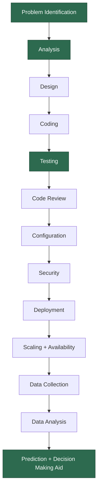

- **Problem Identification** — defining the product vision and deciding *which* problems are worth solving and in what order
- **Analysis** — prioritising the backlog; breaking down goals into deliverable pieces the team can act on each sprint
- **Testing** — accepting or rejecting completed work based on whether it meets the business need, not just technical correctness
- **Prediction + Decision Making Aid** — using data and market insights to shape product strategy and roadmap decisions

---

## 🎯 Key Takeaways
- Software = systems + people + process
- Security is everywhere
- Many career paths from the same foundations
- Real work = team problem solving
